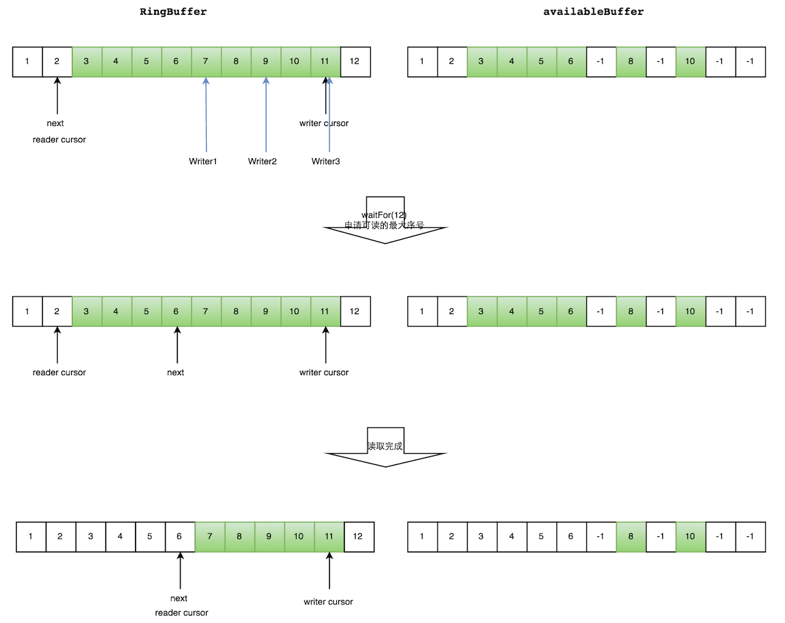
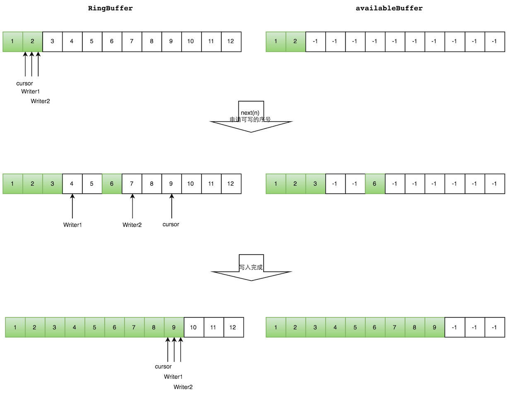
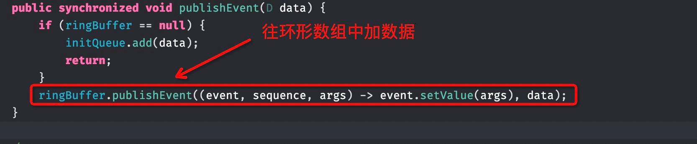
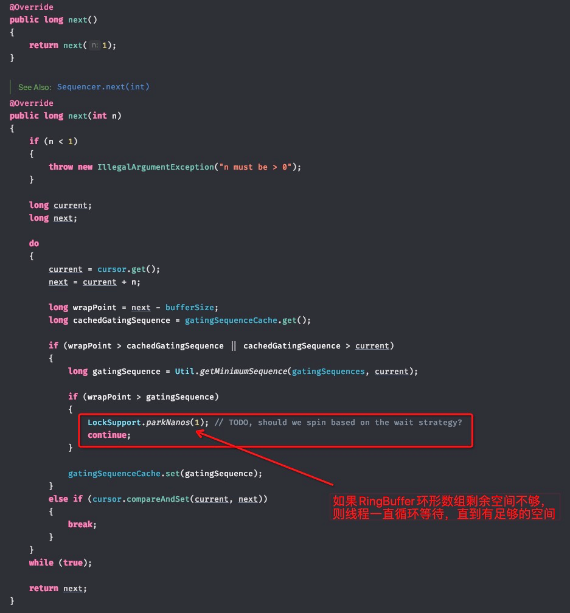
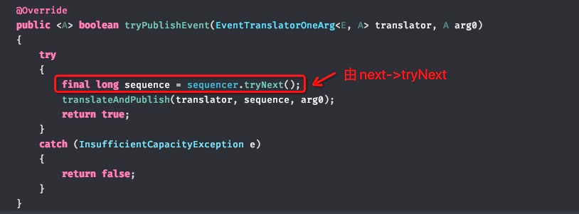
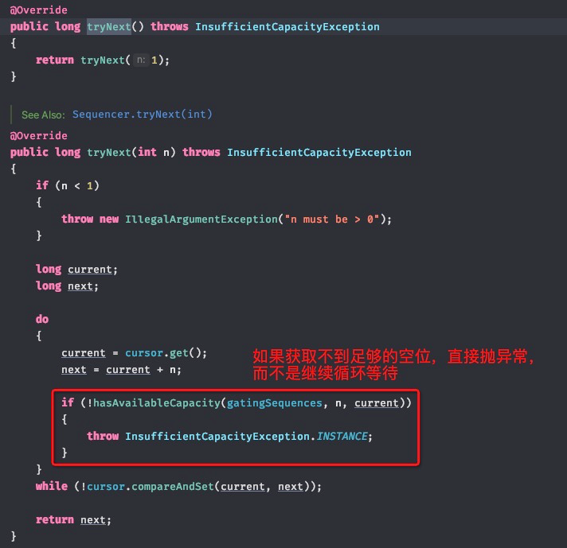
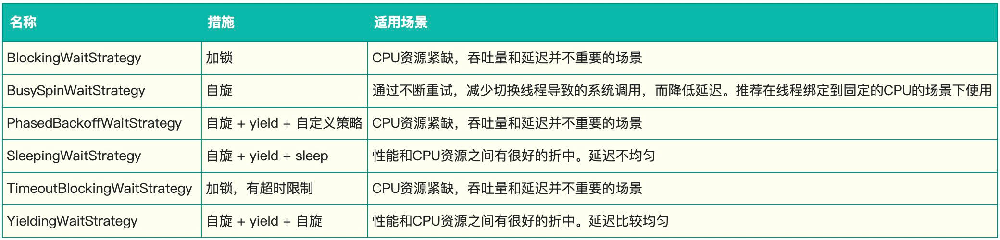

背景
双十一大促值班期间，我所负责的某个应用的某个接口出现大量超时失败，导致上游系统进行不断的重试，出现性能问题。通过Arthas进行调用链跟踪，发现代码中使用Disruptor队列的地方出现超时；进而转向对Disruptor这个消息队列进行分析。
一、Arthas的使用
在分析接口超时问题时，使用了Arthas工具，所以这里稍微介绍一下Arthas的基本使用方法，如果需要更详细具体的使用方法，可以参考Arthas的使用手册https://arthas.aliyun.com/doc/；
首先，我们应用的应用有进行xflush报警监控，出现大量超时的服务器IP会通知到应用负责人；登陆超时比较频繁的服务器；所以执行以下指令：
1、curl -L http://start.alibaba-inc.com/install.sh | sh
2、./as.sh
3、选择com.taobao.pandora.boot.loader.SarLauncher

这个时候就可以使用Arthas指令观测所需要的信息了；因为需要观察超时，所以我只执行了以下脚本就够了：
trace com.alibaba.ascp.finance.charge.scheduler.application.processor.ChargeTaskCreateProcessorImpl doAfter  -n 5 #cost>3000
com.alibaba.ascp.finance.charge.scheduler.application.processor.ChargeTaskCreateProcessorImpl 表示类名
doAfter 表示方法名
-n 表示方法执行的次数
#cost 表示>3000ms的链路会打印出来

大家也可以在Idea安装Arthas插件，然后右键点击方法名，选择Arthas Commond就可以直接生成Arthas指令，推荐大家试试；
二、Disruptor简介
Disruptor是英国外汇交易公司LMAX开发的一个高性能队列，研发的初衷是解决内存队列的延迟问题（在性能测试中发现竟然与I/O操作处于同样的数量级）。基于Disruptor开发的系统单线程能支撑每秒600万订单，2010年在QCon演讲后，获得了业界关注。2011年，企业应用软件专家Martin Fowler专门撰写长文介绍。同年它还获得了Oracle官方的Duke大奖。
目前，包括Apache Storm、Camel、Log4j 2在内的很多知名项目都应用了Disruptor以获取高性能。
1、Disruptor设计方案
Disruptor通过以下设计来解决队列速度慢的问题：
●
环形数组结构
为了避免垃圾回收，采用数组而非链表。同时，数组对处理器的缓存机制更加友好。
●
元素位置定位
数组长度2^n，通过位运算，加快定位的速度。下标采取递增的形式。不用担心index溢出的问题。index是long类型，即使100万QPS的处理速度，也需要30万年才能用完。
●
无锁设计
每个生产者或者消费者线程，会先申请可以操作的元素在数组中的位置，申请到之后，直接在该位置写入或者读取数据。
2、Disruptor原理简介
Disruptor在我所负责的应用中是使用了多生产者模式，所以本文介绍以下多生产者模式下的Disruptor的工作原理，单生产者相对来说比较简单。
多个生产者的情况下，会遇到“如何防止多个线程重复写同一个元素”的问题。Disruptor的解决方法是，每个线程获取不同的一段数组空间进行操作。这个通过CAS很容易达到。只需要在分配元素的时候，通过CAS判断一下这段空间是否已经分配出去即可。
但是会遇到一个新问题：如何防止读取的时候，读到还未写的元素。Disruptor在多个生产者的情况下，引入了一个与Ring Buffer大小相同的buffer：available Buffer。当某个位置写入成功的时候，便把availble Buffer相应的位置置位，标记为写入成功。读取的时候，会遍历available Buffer，来判断元素是否已经就绪。
下面分读数据和写数据两种情况介绍。
读数据
1.
申请读取到序号n；
2.
若writer cursor >= n，这时仍然无法确定连续可读的最大下标。从reader cursor开始读取available Buffer，一直查到第一个不可用的元素，然后返回最大连续可读元素的位置；
3.
消费者读取元素。
如下图所示，读线程读到下标为2的元素，三个线程Writer1/Writer2/Writer3正在向RingBuffer相应位置写数据，写线程被分配到的最大元素下标是11。
读线程申请读取到下标从3到11的元素，判断writer cursor>=11。然后开始读取availableBuffer，从3开始，往后读取，发现下标为7的元素没有生产成功，于是WaitFor(11)返回6。
然后，消费者读取下标从3到6共计4个元素。



写数据
多个生产者写入的时候：
1.
申请写入m个元素；
2.
若是有m个元素可以写入，则返回最大的序列号。每个生产者会被分配一段独享的空间；
3.
生产者写入元素，写入元素的同时设置available Buffer里面相应的位置，以标记自己哪些位置是已经写入成功的。
如下图所示，Writer1和Writer2两个线程写入数组，都申请可写的数组空间。Writer1被分配了下标3到下表5的空间，Writer2被分配了下标6到下标9的空间。
Writer1写入下标3位置的元素，同时把available Buffer相应位置置位，标记已经写入成功，往后移一位，开始写下标4位置的元素。Writer2同样的方式。最终都写入完成。


三、Disruptor超时分析
1、Disruptor在项目中使用
环形数组大小配置：1024（必须是2的幂）
等待策略：YieldingWaitStrategy
原先代码中主要是配置以上两个配置，所以我最开始分析是不是因为队列太小了，线程导致阻塞住了；想通过调大数组大小，但是调大数据大小到一个什么值合适呢？如果调太大，肯定内存会有压力，如果太小，还是会出现超时；
然后我开始分析往环形数组RingBuffer中添加数据的源码：
这个是自己封装的一个方法：








分析到这里的时候我已经知道了超时的原因：
1、RingBuffer数组长度太小，导致线程申请数组下标的时候一直申请不到，休眠1ns后，一直在死循环；
2、消费者消费速度太慢（不好改，因为消费者消费耗时比较难进行优化）；
2、Disruptor优化
经过前面分析，如果获取不到数据下标，就一直死循环，在我的这个应用场景下不是很合理，因为我们还有个兜底逻辑，就算队列中没有处理成功，我们通过DTS扫表任务还是会将这个消息进行消费。
所以经过查找Disruptor官方文档，找到了一个比较适合我这个业务场景下的一个API：public <A> boolean tryPublishEvent(EventTranslatorOneArg<E, A> translator, A arg0)





通过在预发环境进行压测，将RingBuffer的publishEvent->tryPublishEvent，已经可以满足在大促期间的系统压力；其实还可以优化队列的长度，根据自身系统的QPS等因素进行队列长度的设置；
前面还提到了等待策略，其实等待策略分为两种：
1、生产者的等待策略只有：LockSupport.parkNanos(1); 休眠1ns；
2、消费者的等待策略：我的应用当前使用的是YieldingWaitStrategy，这个会导致CPU自旋空转，导致CPU占用比较高。其它同事已经将YieldingWaitStrategy改成了SleepingWaitStrategy，CPU占用高的问题也得到了改善，以下针对各个场景的等待策略进行了归类：


参考文档
https://tech.meituan.com/2016/11/18/disruptor.html
https://github.com/LMAX-Exchange/disruptor/wiki/Performance-Results
https://arthas.aliyun.com/doc/